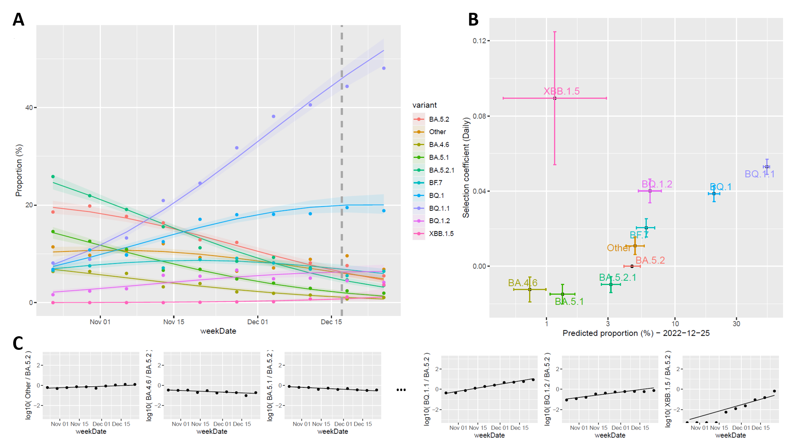
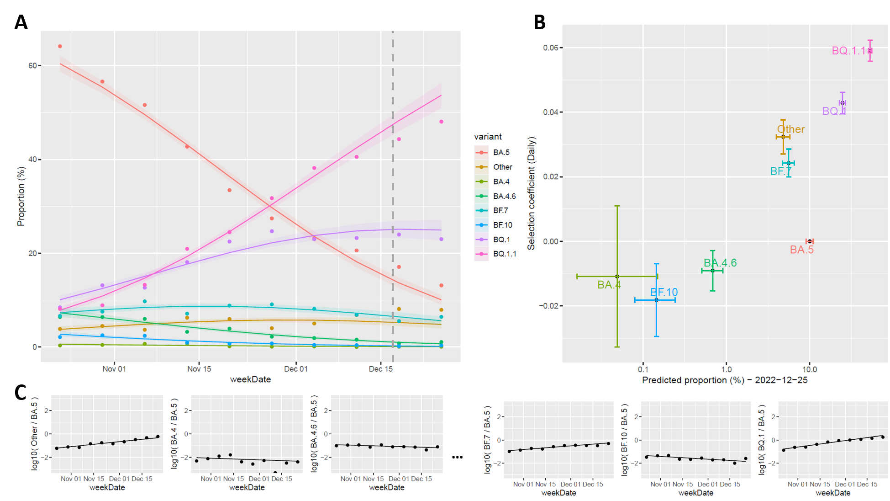
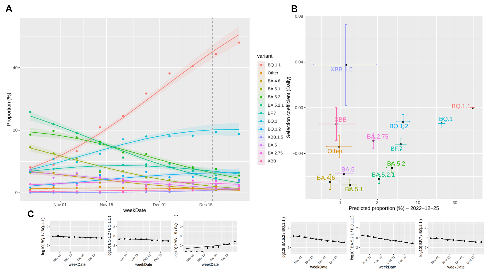

# NML nowcast

National Microbiology Laboratory (NML) Nowcast model scripts for estimating the proportions of SARS-CoV-2 lineages  

[](https://github.com/phac-nml/NML_Nowcast/blob/main/READMEFR.md)  

## Description
This repository contains the scripts for the NML Nowcast model used for estimating proportions of SARS-CoV-2 variants/lineages circulating in Canada in recent epidemiological weeks. Changes in the relative proportions of variants over time are used in SARS-CoV-2 evolution tracking to monitor the competition dynamics of variants, such that dominance of any particular variant changes over time. These evolutionary dynamics can have varying effects on the epidemiology or on disease profiles. This genomic surveillance method informs on the emergence of new variants, their speed of relative growth, and of dominance periods of the various lineages over time. Nowcasting is a modelling approach used for short-term forecasts of variant proportions to compensate for delays in sample collection, sequencing, and Pango lineage identification. The statistical model is trained on counts of selected variants from previous weeks through genomic surveillance, and it provides estimates of their proportions as well as the corresponding 95% prediction intervals for upcoming weeks. The model building and proportion estimation are conducted on an ongoing basis as new data entries accumulate over time.

### NML Nowcast model
A multinomial log-linear model (variant ~ week) is constructed using a neural network approach, incorporating additional parameters such as the selection of focus lineages, the number of weeks to be modelled, the modelling end date and the reference lineage group. Regardless of the approach taken to select the focus lineages for modelling, counts of the modelled variants/lineages include aggregations from counts of their sublineages, if applicable. To prevent double counting, the aggregations of focus variants are mutually exclusive through leveraging the Pango lineage hierarchy. Lineages that do not belong to any of the sublineages of the chosen lineages are aggregated under the "Other" lineage category. Together, this gives a final set of *i* number of lineages to model, called the *focus lineages*. From this set, a *reference lineage* is chosen, which is usually the lineage that has been dominant recently (i.e. is the lineage most new emerging lineages are competing against). Subsequently, a model is constructed based on aggregated counts of the focus lineages of each epidemiological week within the modelling period. The *modelling period* is the number of weeks on which the model is trained, *n* (default: 8 weeks). This model provides the estimates of the relative proportions for the most recent *m* epidemiological weeks (default: 2 weeks) even when data is incomplete, and the 95% prediction intervals are estimated using sampled coefficients based on the Hessian matrix. The estimated selection coefficients are presented relative to that of the reference lineage.
Below are variations of the model (e.g. standard, web, etc.) based on differences of how the focus lineages are chosen, but the underlying modelling method remains the same. 


### Visualization
The figures below are generated from a sub-sampled example dataset with a specified modelling end date. In practice, this modelling end date is selected to be *m*+1 epidemiological weeks prior to the current date. In Figure A, data points represent the actual weekly proportions, while the fitted curves and 95% prediction interval bands are estimated from the model. Variants are distinguished by colors. The dashed vertical line indicates the final day of the modelling period. Fitted curves to the right of the vertical line represent the forecasted projections. In Figure B, each modeled variant is depicted as a point and distinguished by colors. The x-axis shows the corresponding proportion estimates for the final forecasted week, and the y-axis represents the daily selection coefficients relative to the reference group. The 95% prediction and confidence intervals of the proportion estimates and coefficients are illustrated through horizontal and vertical lines, respectively. Figure C displays logit plots of a subset of variants with respect to the reference group. The log ratios from the actual data are shown as points for each epidemiological week, whereas the lines are from model estimations. 


## Table of contents

- [Standard model - automated variant selection](#standard-model---automated-variant-selection)
- [Lineages of Interest (LOI) model with specified lineages to model by users](#lineages-of-interest-loi-model-with-specified-lineages-to-model-by-users)
- [Web model](#web-model---a-two-tier-filtering-approach)
- [Usage](#Usage)

## Standard model - automated variant selection
In the standard approach, every variant with at least *k* sequences (default: 50) within any of the *n* modelled and *m* forecasted weeks (default total: 10 weeks) is automatically designated as a focus lineage. Variants that do not reach this threshold count, are rolled into a focus lineage if they are phylogenetic descendants. If they are not related to any focus lineages, then they are aggregated within the “Other” group. The model is designed to classify these lineage groups across time. Note that in this example, the reference lineage is BA.5.2.



## Lineages of Interest (LOI) model with specified lineages to model by users
The LOI model is a more custom, manually curated approach, that is used for different purposes, e.g. simplified and more aggregated analyses. In the LOI approach, users can define focus lineages and the variants that do not fall within the focus lineages are then aggregated into the "Other" group. Note that in this example, the reference lineage is BA.5.



## Web model - a two-tier filtering approach
The web model is the method used for powering the analytics and visualization found on the public facing website of the PHAC COVID-19 epidemiological update portal (https://health-infobase.canada.ca/covid-19/testing-variants.html). This approach is a combination of the standard and LOI models, in order to aid in creating accessible colour schemes for the web visualization. As in the standard model, every variant with at least *k* sequences (default: 50) within any of the *n* modelled and *m* forecasted weeks are automatically designated as a focus lineage. These focus lineages are then further stratified by the LOI model, grouped under user-defined *parental supergroups*, in which several lineages share direct ancestry. In any given supergroup, only a maximum of 5 lineages (6 if the specified supergroup lineage was a focus lineage) with the highest counts will follow, the rest will be re-grouped into a lineage-sharing ancestry. If a lineage does not fall within any supergroup then it is designated its own group (these are shown under the “Other” supergroup).



## Usage
### Download
```
git clone https://github.com/phac-nml/NML_nowcast
```

### Install dependencies (R packages)
```
# install dependencies within R
install.packages(c("plyr", "tidyverse", "nnet", "emmeans", "HelpersMG", "reshape2", "ggplot2", "ggrepel", "ggeffects", "ggpubr", "rjson","dplyr", "rstudioapi", "plotly", "ggthemes", "ggrepel", "scales", "plyr", "rpivotTable", "data.table", "DT", "htmltools"), repos="http://cran.us.r-project.org")
```

### Run nowcast
To execute the nowcast model and generate the aforementioned figures, prediction tables and a report, please refer to the file "scripts/main_script_webversion.r".


## Legal ##
-----------

Copyright Government of Canada 2023

Written by: National Microbiology Laboratory, Public Health Agency of Canada

Licensed under the Apache License, Version 2.0 (the "License"); you may not use
this work except in compliance with the License. You may obtain a copy of the
License at:

http://www.apache.org/licenses/LICENSE-2.0

Unless required by applicable law or agreed to in writing, software distributed
under the License is distributed on an "AS IS" BASIS, WITHOUT WARRANTIES OR
CONDITIONS OF ANY KIND, either express or implied. See the License for the
specific language governing permissions and limitations under the License.


## References ##
---------------
[1] Pango lineage: https://github.com/cov-lineages  
[2] CDC model: https://github.com/CDCgov/SARS-CoV-2_Genomic_Surveillance

------------------------------------------------------------------------
<c>NML Nowcast is developed and maintained by Julie Chen and Nelson Mok</c>

