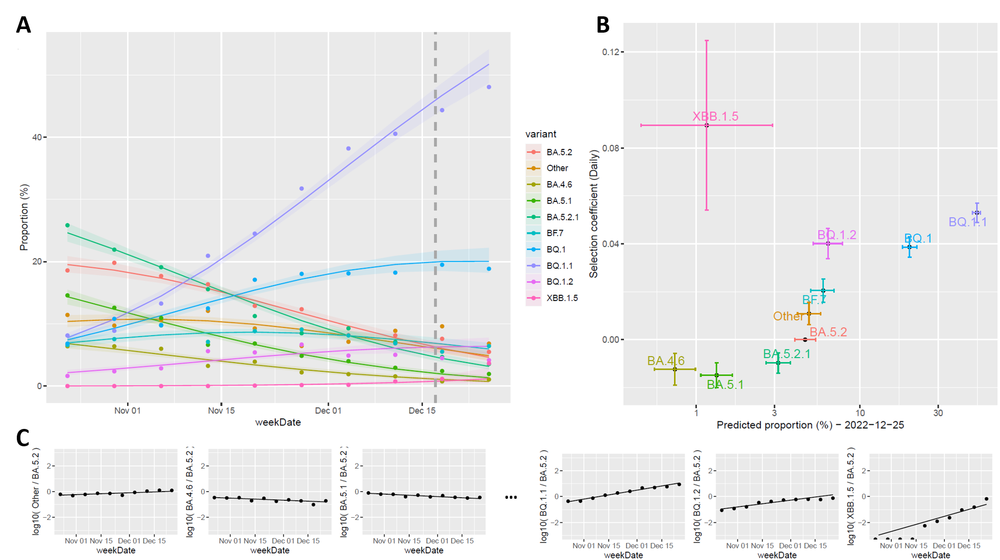
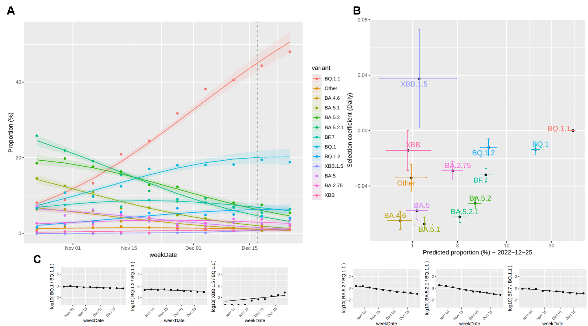

# Modèle de prévisions immédiates du LNM

Scripts du modèle Nowcast utilisé par le Laboratoire national de microbiologie (LNM) pour l’estimation des proportions des lignées du SRAS-CoV-2.  

[](https://github.com/phac-nml/NML_Nowcast/blob/main/README.md)  

## Description
Ce dépôt contient les scripts du modèle Nowcast utilisé par le LNM pour estimer la proportion des variants/lignées du SRAS-CoV-2 circulant au Canada au cours des semaines épidémiologiques les plus récentes. Les changements dans les proportions relatives des variants au fil du temps permettent de suivre l’évolution du SRAS-CoV-2 et de surveiller la dynamique de la compétition entre les variants, étant donné que la prédominance des variants évolue en fonction du temps. Cette dynamique évolutive peut avoir des effets variables sur l’épidémiologie ou sur le profil de la maladie. La méthode de surveillance génomique que nous adoptons nous renseigne sur l’émergence de nouveaux variants, sur leur vitesse de croissance relative et sur les périodes de dominance des différentes lignées au fil du temps. Les prévisions immédiates (nowcasting) sont une approche de modélisation utilisée pour les prévisions à court terme des proportions de variants afin de compenser les retards dans la collecte des échantillons, le séquençage et l’identification des lignées Pango. Le modèle statistique est entraîné en fonction du nombre de variants sélectionnés observés au cours des semaines précédentes dans le cadre des activités de surveillance génomique. Il fournit une estimation de la proportion de ces variants ainsi que les intervalles de prédiction à 95 % correspondants pour les semaines à venir. L’élaboration du modèle et l’estimation des proportions sont effectuées en continu, au fur et à mesure que de nouvelles données s’accumulent.

### Modèle Nowcast du LNM
Un modèle log-linéaire multinomial (variant ~ semaine) est construit à l’aide d’une approche de réseau neuronal et comprend des paramètres supplémentaires comme les lignées cibles sélectionnées, le nombre de semaines à modéliser, la date de fin de modélisation et le groupe de la lignée de référence. Quelle que soit l’approche utilisée pour sélectionner les lignées qui feront l’objet d’une modélisation, le dénombrement des variants/lignées modélisés inclut les données agrégées du dénombrement des sous-lignées de chaque lignée cible, le cas échéant. Afin d’éviter un dénombrement en double, l’agrégation des variants ciblés est réalisée de façon mutuellement exclusive à l’aide de la hiérarchie des lignées Pango. Les lignées qui n’appartiennent à aucune des sous-lignées des lignées choisies sont regroupées dans la catégorie « Autres ». On obtient ainsi un ensemble final de *i* lignées à modéliser, que l’on appelle les *lignées cibles*. Dans cet ensemble, on choisit une *lignée de référence*, généralement celle qui est dominante depuis un certain temps (c’est-à-dire celle contre laquelle la plupart des lignées émergentes sont en compétition). On construit ensuite un modèle en se fondant sur les dénombrements correspondant aux lignées cibles pour chaque semaine épidémiologique au cours de la période de modélisation. La *période de modélisation* est le nombre de semaines servant à l’entraînement du modèle, soit *n* (par défaut : 8 semaines). Ce modèle fournit une estimation des proportions relatives pour les *m* semaines épidémiologiques les plus récentes (par défaut : 2 semaines), même lorsque les données sont incomplètes, et les intervalles de prédiction à 95 % sont estimés à l’aide de coefficients échantillonnés d’après la matrice hessienne. Les coefficients de sélection estimés sont présentés avec celui de la lignée de référence.
Des variations du modèle sont présentées ci-dessous (standard, Web, etc.), en fonction des lignées cibles sélectionnées, mais la méthode de modélisation sous-jacente demeure la même. 

### Visualisation
Les figures ci-dessous sont générées à partir d’un exemple de données sous-échantillonnées pour une certaine date de fin de modélisation. Dans les faits, cette date de fin de modélisation correspond à *m* + 1 semaines épidémiologiques avant la date actuelle. Dans la figure A, les points de données représentent les proportions hebdomadaires réelles, tandis que les courbes ajustées et les intervalles de prédiction à 95 % sont estimés à partir du modèle. Chaque variant est présenté avec une couleur différente. La ligne pointillée verticale indique le dernier jour de la période de modélisation. Les courbes ajustées à la droite de la ligne verticale représentent les prévisions. Dans la figure B, chaque variant modélisé est représenté par un point d’une couleur distincte. L’axe des abscisses montre les estimations de proportion correspondantes pour la dernière semaine faisant l’objet d’une prévision, et l’axe des ordonnées représente les coefficients de sélection quotidiens relativement à celui du groupe de référence. Les intervalles de prédiction et les intervalles de confiance à 95 % des estimations de proportion et des coefficients sont illustrés par des lignes horizontales et verticales, respectivement. La figure C présente les courbes de fonction logit d’un sous-ensemble de variants par rapport au groupe de référence. Les rapports logarithmiques des données réelles sont représentés par des points pour chaque semaine épidémiologique, et les lignes correspondent aux estimations du modèle. 

## Table des matières
- [Modèle standard – sélection automatisée des variants](#modèle-standard--sélection-automatisée-des-variants)
- [Modèle des lignées d’intérêt, à savoir les lignées à modéliser spécifiées par les utilisateurs](#modèle-des-lignées-dintérêt-à-savoir-les-lignées-à-modéliser-spécifiées-par-les-utilisateurs)
- [Modèle Web](#modèle-web--approche-de-filtrage-à-deux-niveaux)
- [Utilisation](#Utilisation)

## Modèle standard – sélection automatisée des variants
Selon l’approche standard, chaque variant comportant au moins *k* séquences (par défaut : 50) dans l’une des *n* semaines modélisées et des *m* semaines faisant l’objet de prévisions (total par défaut : 10 semaines) est automatiquement désigné comme étant une lignée cible. Les variants qui n’atteignent pas ce seuil de dénombrement sont intégrés à une lignée cible s’il s’agit de descendants phylogénétiques. Si ces variants ne sont apparentés à aucune lignée cible, ils sont inclus dans le groupe « Autres ». Le modèle est conçu pour classer ces groupes de lignées en fonction du temps. Il est à noter que, dans cet exemple, la lignée de référence est BA.5.2.



## Modèle des lignées d’intérêt, à savoir les lignées à modéliser spécifiées par les utilisateurs
Le modèle des lignées d’intérêt constitue une approche plus personnalisée, élaborée manuellement, qui est utilisée à des fins différentes, par exemple pour des analyses de données simplifiées ou de données davantage agrégées. Selon cette approche, les utilisateurs peuvent définir des lignées cibles, et les variants qui n’ont aucun lien avec ces lignées sont inclus dans le groupe « Autres ». Il est à noter que, dans cet exemple, la lignée de référence est BA.5.


## Modèle Web – approche de filtrage à deux niveaux
Le modèle Web est la méthode utilisée pour alimenter les analyses et les visualisations apparaissant dans la partie publique du portail Mise à jour sur l’épidémiologie de la COVID-19 de l’ASPC (https://sante-infobase.canada.ca/covid-19/depistage-variants.html). Cette approche, qui se veut une combinaison du modèle standard et du modèle des lignées d’intérêt, vise à faciliter la création de schémas de couleurs accessibles en vue d’une consultation sur le Web. Comme dans le cas du modèle standard, chaque variant comportant au moins *k* séquences (par défaut : 50) dans l’une des *n* semaines modélisées et des *m* semaines faisant l’objet de prévisions est automatiquement désigné comme étant une lignée cible. Ces lignées cibles sont ensuite stratifiées en fonction du modèle des lignées d’intérêt et incluses dans des *supergroupes parentaux* définis par les utilisateurs, dans lesquels diverses lignées partagent une ascendance directe. Dans chaque supergroupe, seules les cinq lignées associées aux dénombrements les plus élevés suivront (six si la lignée spécifiée pour le supergroupe est une lignée cible); les autres lignées seront incluses dans un groupe de lignées apparentées. Si une lignée ne peut être incluse dans aucun supergroupe, elle est désignée comme un groupe à part entière (ces groupes figurent dans le supergroupe « Autres »).



## Utilisation
### Téléchargement
```
git clone https://github.com/phac-nml/NML_nowcast
```

### Installation des dépendances (paquets R)
```
# Installation des dépendances dans R
install.packages(c("plyr", "tidyverse", "nnet", "emmeans", "HelpersMG", "reshape2", "ggplot2", "ggrepel", "ggeffects", "ggpubr", "rjson","dplyr", "rstudioapi", "plotly", "ggthemes", "ggrepel", "scales", "plyr", "rpivotTable", "data.table", "DT", "htmltools"), repos="http://cran.us.r-project.org")
```

### Exécution du modèle de prévision immédiate
Pour exécuter le modèle de prévision immédiate et générer les figures susmentionnées, des tableaux de prédiction et un rapport, consulter le fichier « scripts/main_script_webversion.r ».

## Information juridique ##
-----------
Tous droits réservés © Gouvernement du Canada (2023)

Rédigé par : Laboratoire national de microbiologie, Agence de la santé publique du Canada

Sous licence Apache, version 2.0 (la « Licence »); il est interdit d’utiliser cette œuvre autrement qu’en conformité avec la Licence.
 Il est possible d’obtenir une copie de la Licence à l’adresse suivante :

http://www.apache.org/licenses/LICENSE-2.0

À moins que la loi applicable ne l’exige ou qu’il n’en soit convenu par écrit, les logiciels distribués en vertu de la Licence sont distribués « TELS QUELS », SANS GARANTIE NI CONDITION DE QUELQUE NATURE QUE CE SOIT, expresse ou implicite.

 Voir la licence pour prendre connaissance des modalités régissant les autorisations et limites prévues dans la Licence.
 

## Références ##
---------------
[1] Lignées Pango : https://github.com/cov-lineages  
[2] Modèle des CDC : https://github.com/CDCgov/SARS-CoV-2_Genomic_Surveillance

------------------------------------------------------------------------
Le modèle Nowcast du LNM a été conçu et est entretenu par Julie Chen et Nelson Mok.
